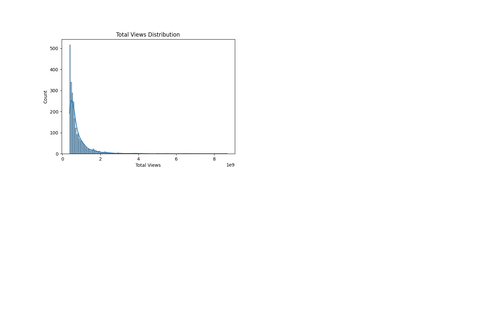
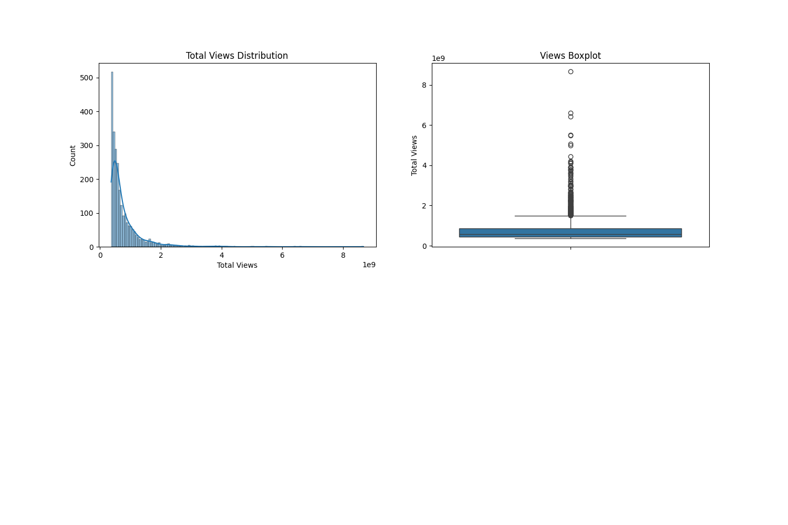

# Music Video Data Analysis

This project focuses on the analysis of the most viewed music videos of all time using Python and the Pandas library. It includes data cleaning, transformation, visualization, and filtering techniques to gain insights into the popularity of music content on platforms like YouTube.

## 📁 Project Structure

```
Data_Analysis/
├── datasets/
│   ├── music_videos.csv
│   ├── music_videos_cleaned.csv
│   └── music_videos_normalized.csv
├── notebooks/
│   └── pandas_basics.ipynb
├── scripts/
│   ├── data_cleaning.py
│   └── create_visualizations.py
├── visuals/
│   ├── total_views_histogram.png
│   ├── total_views_boxplot.png
│   ├── top_10_artists_bar.png
│   └── summary_4plots.png
└── README.md
```

## 🔍 Features

- **Data Cleaning**: Removes formatting characters and handles missing values.
- **Normalization**: Applies Min-Max scaling on view counts.
- **Standardization**: Uses z-score for normalization.
- **Visualization**: Includes histograms, boxplots, and bar charts.
- **Filtering**: Selects records based on view thresholds using Pandas filtering, `.query()` and `.where()`.
- **GroupBy Analysis**: Finds top artists by total views and video count.
- **Merge & Join**: (Optional) Merge external data on artists for richer analysis.

## 📊 Visual Results

Here are some examples of the generated visualizations:

### Total Views Distribution


### Views Boxplot


### Top 10 Artists by Views


### All-in-One Summary


## 📦 Requirements

To run this project, install the following Python packages:

```bash
pip install pandas matplotlib seaborn scikit-learn
```

## ▶️ How to Run

1. Clone the repository.
2. Navigate to the project directory.
3. Run the notebook in `notebooks/pandas_basics.ipynb`.
4. Or run the cleaning script:
```bash
python scripts/data_cleaning.py
```

## 📌 Notes
- The original dataset must be placed in the `datasets/` folder as `music_videos.csv`.
- Generated outputs are saved in `datasets/` and `visuals/`.

---

Made with 💻 by Delfin Kütükcü

